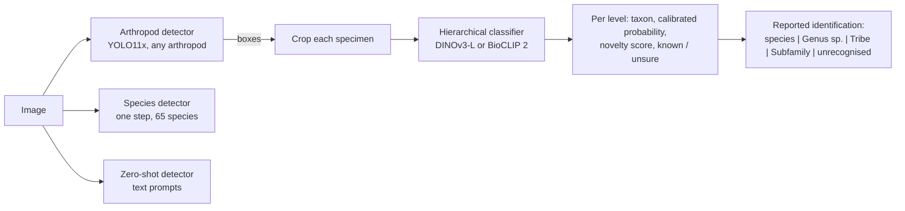

# Intelligent Bark Beetle Identifier (IBBI)

[](https://badge.fury.io/py/ibbi)
[](https://opensource.org/licenses/MIT)
[](https://gcmarais.com/IBBI/)
[](https://colab.research.google.com/github/ChristopherMarais/IBBI/blob/main/notebooks/ibbi_quickstart.ipynb)

**IBBI** is a Python package for detecting and identifying bark and ambrosia beetles (Curculionidae: Scolytinae and
Platypodinae) in images. It gives one interface to detectors, a hierarchical classifier that says how sure it is at
every taxonomic level, zero-shot detectors, and a crowd-aware evaluator for the
[Bark and Ambrosia Beetle Detection Benchmark](https://huggingface.co/datasets/IBBI-bio/bark-ambrosia-beetle-benchmark).

```python
import ibbi

pipe = ibbi.create_pipeline()                 # arthropod detector + hierarchical classifier
result = pipe.predict("trap_sample.jpg")
for box, rec in zip(result["boxes"], result["classifications"]):
    print(box, rec["reported"])               # e.g. "Xyleborus volvulus" or "Euwallacea sp. (species undetermined)"
```

### Motivation

Regulatory decisions about bark and ambrosia beetles (quarantine, eradication, port interception) are made at the level
of species, but specimens are hard to identify: congeners are near-identical and the specialists who can separate them
are few. IBBI makes trained, benchmarked models available with a single function call, so that researchers and
diagnosticians can automate detection and identification, and see where the models can and cannot be trusted.

### Key features

* **Two-stage identification** (`ibbi.create_pipeline()`): a universal arthropod detector finds every specimen; a
  hierarchical classifier names each one at subfamily, tribe, genus and species, with a calibrated probability and a
  "known / unsure" decision per level. It answers at the deepest level it trusts ("*Euwallacea* sp.", "Xyleborini",
  "unrecognised") instead of always forcing a species name.
* **One-step species detectors** for the 65 trainable species of the benchmark, in six architectures (YOLOv8x,
  YOLOv9e, YOLOv10x, YOLO11x, YOLO12x, RT-DETR-X).
* **Zero-shot detectors** driven by text prompts: Grounding DINO, OWLv2, YOLO-World and SAM 3.
* **Embeddings** from the fine-tuned classifier backbones (`extract_features`).
* **Benchmark access and crowd-aware evaluation**: `ibbi.get_dataset()` loads any split of the benchmark and
  `ibbi.Evaluator` scores any model with the benchmark's reference evaluator, the hierarchical metrics or embedding
  metrics.
* **Explainability** with LIME and SHAP for every model (`ibbi.Explainer`).

---

## Table of contents

- [How it works](#how-it-works)
- [Installation](#installation)
- [Quick start](#quick-start)
- [Available models](#available-models)
- [Benchmark results](#benchmark-results)
- [Usage](#usage)
- [The dataset](#the-dataset)
- [Licences](#licences)
- [How to contribute](#how-to-contribute)
- [Citation](#citation)

---

## How it works



* The **arthropod detector** was trained on the IBBI arthropod detection corpus (307,421 images from 14 sources: lab
  photographs and scans, light traps, sticky cards and pitfall trays, camera traps and field photographs).
* The **hierarchical classifier** was trained on the benchmark's 65 trainable species. Its head is tree-factorised:
  the probabilities of the four levels are consistent by construction. Each level has a temperature (calibration) and
  a novelty score; the level is "known" when the score passes a threshold set on known validation beetles only. No
  real unknown beetles were used to train it or to set any threshold.
* The **species detectors** were trained on the benchmark's `train` split; each architecture was trained with three
  seeds and the seed with the best validation fitness is shipped.
* All weights are hosted in the [IBBI-bio](https://huggingface.co/IBBI-bio) organisation on the Hugging Face Hub;
  each repository has a model card with training details, benchmark numbers and licence terms.

---

## Installation

IBBI needs Python ≥ 3.11 and PyTorch. Install PyTorch for your hardware first
([pytorch.org](https://pytorch.org/get-started/locally/)), then:

```bash
pip install ibbi
```

or the development version:

```bash
pip install git+https://github.com/ChristopherMarais/IBBI.git
```

Notes:

* IBBI requires `ultralytics>=8.3.139,<8.4`. Ultralytics 8.4 changes the predictions of the YOLOv10 and RT-DETR
  checkpoints, which were trained and benchmarked with 8.3.
* SAM 3 is gated on the Hugging Face Hub: accept its licence at https://huggingface.co/facebook/sam3 and run
  `hf auth login` before using `sam3_zero_shot_detector`.
* YOLO-World downloads its text encoder (CLIP) through Ultralytics on first use.
* Weights and dataset files are cached in `~/.cache/ibbi` (override with `IBBI_CACHE_DIR`). Set `IBBI_MODELS_DIR` to a
  folder with one sub-folder per model repository to load weights offline.

**Hardware.** A CUDA GPU with ≥ 8 GB memory is recommended (the classifiers and zero-shot models are ViT-L sized); CPU
inference works but is slow. Downloading the full benchmark needs about 27 GB of disk.

---

## Quick start

```python
import ibbi

ibbi.list_models()                                    # the model table, with benchmark numbers

# Two-stage identification
pipe = ibbi.create_pipeline()
res = pipe.predict("plate.jpg")
res["labels"]          # reported identification per specimen
res["species"]         # the classifier's best species per specimen
res["classifications"][0]["genus"]   # {"taxon", "prob", "score", "known", "threshold", "top3", ...}

# One-step species detection
det = ibbi.create_model("species_detector")           # YOLO12x species detector
det.predict("plate.jpg")                              # {"boxes", "scores", "labels", ...}

# Zero-shot detection
zs = ibbi.create_model("zero_shot_detector")          # Grounding DINO
zs.predict("plate.jpg", text_prompt="beetle . insect")
```

---

## Available models

| Name (`ibbi.create_model`) | Task | Architecture | Licence of the weights |
|---|---|---|---|
| `yolov8x_species_detector` | species detection (65 species) | YOLOv8x | AGPL-3.0 |
| `yolov9e_species_detector` | species detection (65 species) | YOLOv9e | AGPL-3.0 |
| `yolov10x_species_detector` | species detection (65 species) | YOLOv10x | AGPL-3.0 |
| `yolo11x_species_detector` | species detection (65 species) | YOLO11x | AGPL-3.0 |
| `yolo12x_species_detector` | species detection (65 species) | YOLO12x | AGPL-3.0 |
| `rtdetrx_species_detector` | species detection (65 species) | RT-DETR-X | AGPL-3.0 |
| `yolo11x_arthropod_detector` | arthropod detection (single class) | YOLO11x | AGPL-3.0 |
| `dinov3_hierarchical_classifier` | hierarchical classification with abstention, embeddings | DINOv3 ViT-L/16 | DINOv3 License |
| `bioclip2_hierarchical_classifier` | hierarchical classification with abstention, embeddings | BioCLIP 2 ViT-L/14 | MIT |
| `grounding_dino_zero_shot_detector` | zero-shot detection | Grounding DINO-B | Apache-2.0 (upstream) |
| `owlv2_zero_shot_detector` | zero-shot detection | OWLv2-L | Apache-2.0 (upstream) |
| `yoloworld_zero_shot_detector` | zero-shot detection | YOLO-World v2-X | AGPL-3.0 (upstream) |
| `sam3_zero_shot_detector` | zero-shot detection | SAM 3 | SAM License (upstream, gated) |

Aliases: `arthropod_detector` / `beetle_detector` → `yolo11x_arthropod_detector`; `species_detector` →
`yolo12x_species_detector` (best validation fitness of the six); `hierarchical_classifier` / `species_classifier` /
`feature_extractor` → `dinov3_hierarchical_classifier`; `zero_shot_detector` → `grounding_dino_zero_shot_detector`
(best of the zero-shot models on the detector-corpus validation sample).

Details of every model: [docs/models.md](docs/models.md).

---

## Benchmark results

Every model was run through `ibbi.Evaluator` on the benchmark v2.0.1 with its default settings (nothing tuned on the
benchmark); the full tables, protocol and caveats are in [docs/benchmark.md](docs/benchmark.md) and the scripts in
[`benchmarks/`](benchmarks/).

<!-- BENCHMARK_SUMMARY_START -->
_Results are filled in by `benchmarks/make_tables.py`._
<!-- BENCHMARK_SUMMARY_END -->

---

## Usage

The [usage guide](docs/usage.md) covers every function. Short examples:

**Hierarchical classification of crops, operating points and embeddings**

```python
clf = ibbi.create_model("hierarchical_classifier")              # operating point "gallery" by default
rec = clf.predict("crop.jpg")
rec["reported"], rec["depth"], rec["depth_by_op"]               # depth under 0.90 / 0.95 / 0.99 / gallery
clf.predict("photo.jpg", boxes=[[10, 20, 300, 400]])            # classify boxes of a larger image
clf = ibbi.create_model("hierarchical_classifier", operating_point="0.99")   # accept 99% of known beetles per level
emb = clf.extract_features("crop.jpg")                          # [1, 2048] embedding
```

**Benchmark data and evaluation**

```python
test = ibbi.get_dataset("iid_test")             # also "train", "inat_test", "semantic_ood"
item = test[0]                                  # {"image", "image_id", "objects": {"bbox", "category", "iscrowd", ...}}

ev = ibbi.Evaluator(ibbi.create_model("species_detector"))
scores = ev.benchmark()                         # crowd-aware reference evaluator on iid_test, inat_test, semantic_ood
scores["headline"]

ibbi.Evaluator(ibbi.create_model("hierarchical_classifier")).hierarchical_classification()
ibbi.Evaluator(ibbi.create_model("feature_extractor")).embeddings(test)
```

**Explainability**

```python
model = ibbi.create_model("hierarchical_classifier")
explainer = ibbi.Explainer(model)
explanation, image = explainer.with_lime(crop, image_size=(336, 336))
ibbi.plot_lime_explanation(explanation, image)
background = ibbi.get_shap_background_dataset(image_size=(336, 336))
shap_values = explainer.with_shap([{"image": crop}], background, num_explain_samples=1, image_size=(336, 336))
```

---

## The dataset

IBBI uses one dataset: the **Bark and Ambrosia Beetle Detection Benchmark v2.0.1**
([Hugging Face](https://huggingface.co/datasets/IBBI-bio/bark-ambrosia-beetle-benchmark),
[Zenodo DOI 10.5281/zenodo.22695714](https://doi.org/10.5281/zenodo.22695714)): 14,491 images, 175 species, COCO
format, specimen-disjoint splits.

| Split | Images | Scored specimens | Species | Purpose |
|---|---|---|---|---|
| `train` | 6,096 | 53,040 | 65 | training |
| `iid_test` | 620 | 650 (+4,367 crowd) | 65 | held-out specimens of the trained species |
| `inat_test` | 74 | 80 (+8 crowd) | 8 | field photographs of trained species |
| `semantic_ood` | 7,701 | 46,924 | 110 | species never seen in training, banded by taxonomic distance |

Crowd regions (`iscrowd=1`) are real specimens that are not scored; `ibbi.Evaluator` ignores them, as the benchmark
requires. The package pins the dataset to the v2.0.1 revision so results are reproducible. The older datasets
(`ibbi_test_data`, `ibbi_ood_data`, `ibbi_shap_dataset`) are deprecated; `get_ood_dataset()` now returns
`semantic_ood` with a deprecation warning and the SHAP background is sampled from `train`.

---

## Licences

* **Code** of the `ibbi` package: MIT ([LICENSE.md](LICENSE.md)).
* **Model weights** carry their own licences, set by the software and base models they derive from:
  * Ultralytics-trained detectors (species detectors, arthropod detector): **AGPL-3.0**.
  * DINOv3 hierarchical classifier: **DINOv3 License** (Meta). It is a derivative of DINOv3 and is redistributed
    under that licence, whose text ships with the weights; publications using it must acknowledge DINOv3.
  * BioCLIP 2 hierarchical classifier: **MIT**.
  * Zero-shot models are downloaded from their authors under their own licences.
* **Training data terms.** About 60% of the benchmark's training images are CC BY-NC, and the arthropod corpus (and
  the classifiers' non-beetle examples) include iNaturalist 2017 (non-commercial research and education only) and
  IP102 (academic use only). Whether weights inherit the terms of their training data is unsettled; the IBBI weights
  are released for **non-commercial research use**, and commercial users should check each model card.
* **Benchmark**: annotations CC BY 4.0, images under mixed Creative Commons licences (see `image_licences.csv`).

`ibbi` imports Ultralytics, which is AGPL-3.0; software that distributes `ibbi` together with Ultralytics must comply
with the AGPL.

---

## How to contribute

Contributions are welcome; see the [contribution guide](docs/CONTRIBUTING.md).

## Citation

If you use IBBI, please cite the benchmark and the package:

```bibtex
@dataset{marais_bark_ambrosia_benchmark_2026,
  title     = {Bark and Ambrosia Beetle Detection Benchmark},
  author    = {Marais, G. Christopher and Schuster, Layla A. and Johnson, Andrew J. and Kuo, Eric and Dias, Raquel and Hulcr, Jiri},
  year      = {2026},
  publisher = {Zenodo},
  version   = {2.0.1},
  doi       = {10.5281/zenodo.22695714}
}
```
