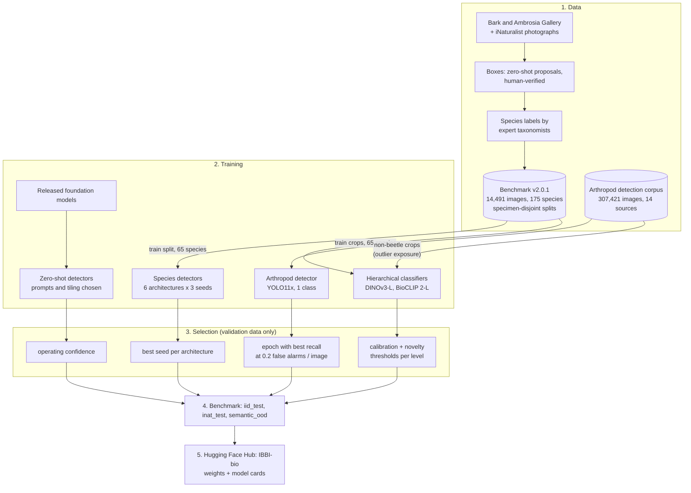
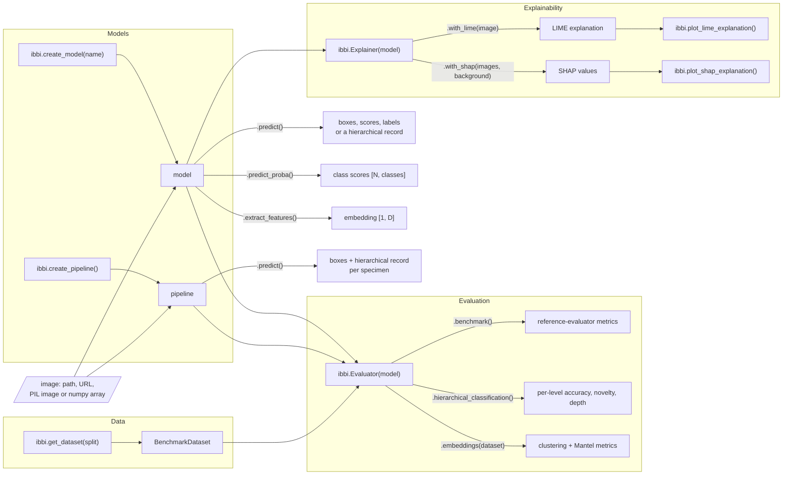

# Intelligent Bark Beetle Identifier (IBBI)

[](https://badge.fury.io/py/ibbi)
[](https://github.com/ChristopherMarais/IBBI/actions/workflows/tests.yml)
[](https://opensource.org/licenses/MIT)
[](https://gcmarais.com/IBBI/)
[](https://huggingface.co/IBBI-bio)
[](https://huggingface.co/datasets/IBBI-bio/bark-ambrosia-beetle-benchmark)
[](https://colab.research.google.com/github/ChristopherMarais/IBBI/blob/main/notebooks/ibbi_quickstart.ipynb)

**IBBI** is a Python package that provides a simple, unified interface for detecting and identifying bark and ambrosia
beetles (Curculionidae: Scolytinae and Platypodinae) in images with trained, benchmarked computer vision models.

It finds every specimen in an image, names it at the deepest taxonomic level it can trust (species, genus, tribe or
subfamily) and says when it does not recognise a beetle, instead of forcing a species name. It also gives access to the
[Bark and Ambrosia Beetle Detection Benchmark](https://huggingface.co/datasets/IBBI-bio/bark-ambrosia-beetle-benchmark)
and scores any model on it with the benchmark's own evaluator.

The package is designed to support entomological research and plant-health diagnostics by automating the laborious
task of beetle identification, enabling high-throughput analysis for ecological studies, pest surveillance, port
interceptions and biodiversity monitoring.

```python
import ibbi

pipe = ibbi.create_pipeline()                 # arthropod detector + hierarchical classifier
result = pipe.predict("trap_sample.jpg")
for box, rec in zip(result["boxes"], result["classifications"]):
    print(box, rec["reported"])               # e.g. "Xyleborus volvulus" or "Euwallacea sp. (species undetermined)"
```

### Motivation

The ability to accurately detect and identify bark and ambrosia beetles is critical for forest health and pest
management: quarantine, eradication and interception decisions are made at the level of species. Traditional methods
face significant challenges:

* **They are slow and time-consuming.** Trap samples and interception lots can contain hundreds of specimens.
* **They require highly specialised expertise.** Many congeners are near-identical, and the taxonomists who can separate
  them are few.
* **They create a bottleneck for large-scale research.** Surveillance programmes generate far more material than can be
  identified by hand.

Automated identification helps only if it is honest about its limits. A model that always answers with one of the
species it was trained on will confidently misname every species it has never seen, and in a regulatory setting a
confident wrong name is worse than no name. IBBI therefore pairs detectors with a **hierarchical classifier that
abstains**: it reports "*Euwallacea* sp." when it is sure of the genus but not the species, and "unrecognised" when the
specimen does not look like any beetle it knows. Every model is benchmarked on species it has never seen, so users can
see where the models can and cannot be trusted.

### What's new in v0.3

* New model set: a universal arthropod detector, hierarchical classifiers with per-level abstention (DINOv3 and
  BioCLIP 2), six retrained species detectors and four zero-shot detectors (Grounding DINO, OWLv2, YOLO-World, SAM 3).
* A two-stage identification pipeline (`ibbi.create_pipeline()`).
* One dataset: the Bark and Ambrosia Beetle Detection Benchmark v2.0.1, with crowd-aware evaluation through the
  benchmark's reference evaluator.
* Every model benchmarked, licences stated per set of weights. See the [changelog](CHANGELOG.md).

### Key Features

* **Model Access:**
  <br>Access every model with a single function call, `ibbi.create_model()`. The following types of models are available:

  * **Two-Stage Identification (recommended):** `ibbi.create_pipeline()` chains the arthropod detector and a
    hierarchical classifier. The detector finds every specimen, each one is cropped, and the classifier names it at
    subfamily, tribe, genus and species, with a calibrated probability and a known / unsure decision per level. This is
    the most accurate way to identify the 65 trained species and the only one that can say "I don't know" for the rest.

  * **Arthropod Detection:** Detect *any* arthropod in an image, whatever its species. A YOLO11x model trained on
    307,421 images from 14 sources (lab photographs and scans, light traps, sticky cards and pitfall trays, camera traps,
    field photographs). It locates specimens but does not name them.

  * **Hierarchical Classification with Abstention:** Name a cropped specimen at four taxonomic levels at once. The
    classifiers (fine-tuned DINOv3 ViT-L and BioCLIP 2 ViT-L) use a tree-factorised head, so the probabilities of the
    levels are always consistent, a temperature per level for calibration, and a novelty score per level to decide
    whether the specimen belongs to a taxon they know. They report the deepest level they trust.

  * **One-Step Species Detection:** Locate and name beetles of the 65 trainable species of the benchmark in a single
    step. Six architectures (YOLOv8x, YOLOv9e, YOLOv10x, YOLO11x, YOLO12x, RT-DETR-X), trained on the benchmark's
    `train` split. Fast and simple, but they always answer with one of their 65 species.

  * **Zero-Shot Detection:** Detect objects from a text prompt (e.g. "beetle", "a photo of an insect") without any
    training on beetle data: Grounding DINO, OWLv2, YOLO-World and SAM 3. Default prompts, image tiling and operating
    confidences were chosen for arthropods on a held-out validation sample.

  * **Feature Extraction:** Extract embeddings from the fine-tuned classifier backbones (`extract_features`) for
    clustering, retrieval or similarity analysis.

* **Benchmark Data:**
  <br>`ibbi.get_dataset()` loads any split of the
  [Bark and Ambrosia Beetle Detection Benchmark v2.0.1](https://huggingface.co/datasets/IBBI-bio/bark-ambrosia-beetle-benchmark)
  (14,491 images, 175 species) at a pinned revision, downloading only the split you ask for.

* **Model Evaluation:**
  <br>`ibbi.Evaluator()` scores any model on the benchmark. Three families of metrics are available:

  * **Benchmark Metrics:** `evaluator.benchmark()` runs the model on the test splits and scores it with the benchmark's
    own crowd-aware reference evaluator (vendored unchanged), so results are directly comparable to published numbers.
    * *Species-level models* (species detectors, pipelines): the COCO suite (AP over IoU 0.50:0.95, AP50, AR@100),
      a decomposition into **detection recall** (share of specimens found), **species accuracy given detection** (share
      of found specimens correctly named), **species recall** (found *and* correctly named) and genus accuracy given
      detection, class-agnostic recall on unseen species, calibration and a novelty AUROC.
    * *Class-agnostic detectors* (arthropod and zero-shot detectors): class-agnostic AP / AR, plus recall, precision and
      false alarms per image at the model's operating confidence.
    * Crowd regions (real specimens that are annotated but not scored) are ignored, as the benchmark requires.

  * **Hierarchical Classification Metrics:** `evaluator.hierarchical_classification()` classifies every ground-truth
    specimen crop and reports, per taxonomic level: **accuracy** and **expected calibration error** on known taxa;
    **novelty AUROC** and FPR at 95% TPR (how well the novelty score separates taxa the classifier knows from taxa it
    does not); the **reported depth** against the ideal depth and the **over-commit rate** (naming a taxon below the
    deepest level that could be right, e.g. naming a species for a beetle whose genus was never seen); and the same
    broken down by **taxonomic distance band** of the unseen species (`near_genus`, `mid_tribe`, `far_tribe`).

  * **Embedding & Clustering Metrics:** `evaluator.embeddings()` extracts one embedding per specimen, reduces it with
    Uniform Manifold Approximation and Projection (UMAP) and clusters it with HDBSCAN, then calculates:

    * **Intrinsic metrics** of cluster quality: Silhouette Score, Davies-Bouldin Index and Calinski-Harabasz Index.
    * **Extrinsic metrics** against the true species labels: Adjusted Rand Index (ARI), Normalized Mutual Information
      (NMI) and Cluster Purity.
    * **Mantel correlation** between embedding distances of species and their **taxonomic distance** (0 same species,
      1 same genus, 2 same tribe, 3 same subfamily, 4 otherwise): does the embedding space reflect the classification?

* **Model Explainability:**
  <br>Gain insight into why a model makes a prediction with integrated explainability methods. The `ibbi.Explainer()`
  wrapper works with every model:

  * **SHapley Additive exPlanations (SHAP):** a game-theory-based approach that attributes a prediction to the parts of
    an image. `explainer.with_shap()` uses SHAP's PartitionExplainer with a blurring masker and a background set
    sampled from the benchmark (`ibbi.get_shap_background_dataset()`).
  * **Local Interpretable Model-agnostic Explanations (LIME):** explains one prediction by fitting an interpretable model
    on perturbed superpixels. `explainer.with_lime()` is a quicker, more intuitive view of which regions of a single
    image drove the decision.

---

## Table of Contents

- [Workflow: How the Models Were Built](#workflow-how-the-models-were-built)
- [Package API and Usage](#package-api-and-usage)
- [Installation](#installation)
  - [Hardware Requirements](#hardware-requirements)
- [Quick Start](#quick-start)
- [Available Models](#available-models)
- [Benchmark Results](#benchmark-results)
- [Advanced Usage](#advanced-usage)
  - [Inference](#inference)
  - [The hierarchical record](#the-hierarchical-record)
  - [Feature Extraction](#feature-extraction)
  - [Model Evaluation](#model-evaluation)
  - [Model Explainability](#model-explainability)
- [The Dataset](#the-dataset)
- [Licences](#licences)
- [How to Contribute](#how-to-contribute)
- [Citation](#citation)
- [License](#license)

---

## Workflow: How the Models Were Built

The trained models in `ibbi` are the result of a data collection, annotation, training and benchmarking pipeline by the
Forest Entomology Lab at the University of Florida.



1. **Data Collection and Curation:** Images come mostly from the Bark and Ambrosia Gallery (lab photographs of
   identified specimens) plus iNaturalist field photographs. A zero-shot detector proposes boxes, which are verified by
   humans; species labels come from expert taxonomists. The result is the
   [Bark and Ambrosia Beetle Detection Benchmark v2.0.1](https://huggingface.co/datasets/IBBI-bio/bark-ambrosia-beetle-benchmark),
   whose splits are disjoint by specimen, and the separate IBBI arthropod detection corpus of 14 public and in-house
   datasets.
2. **Model-Specific Training:**
   * **Arthropod detector:** trained on the arthropod detection corpus (239,477 training images, square-root
     balancing over sources) to find any arthropod in any setting.
   * **Species detectors:** trained in a supervised manner on the benchmark's `train` split (6,096 images, 53,040
     specimens, 65 species) from the Ultralytics COCO checkpoints; three seeds per architecture.
   * **Hierarchical classifiers:** trained on specimen crops of the 65 species with a hierarchical loss, a
     class-balanced sampler and non-beetle arthropod crops as outlier examples (outlier exposure). The DINOv3 model also
     uses synthetic outliers and a hierarchical contrastive loss.

   Note - No additional training is performed for the zero-shot detectors: they use the weights released by their
   authors with prompts and tiling chosen for arthropods.
3. **Selection on Validation Data:** every choice (epoch, seed, configuration, calibration temperatures, novelty
   thresholds, prompts, operating confidences) was made on validation data, never on the benchmark test splits (the one
   exception, the species detectors' seed selection, is disclosed in [docs/benchmark.md](docs/benchmark.md)). No real
   unknown beetles were used to train the classifiers or to set any threshold.
4. **Evaluation:** every model was run on the benchmark's three test splits: held-out specimens of the trained species
   (`iid_test`), field photographs (`inat_test`) and 110 species never seen in training (`semantic_ood`). A summary of
   the results can be viewed with `ibbi.list_models()` or in the [model summary table](src/ibbi/data/ibbi_model_summary.csv);
   the full results are in [docs/benchmark.md](docs/benchmark.md). Evaluation can be re-run with `ibbi.Evaluator()`.
5. **Deployment:** the trained weights are hosted in the [IBBI-bio Hugging Face Hub community](https://huggingface.co/IBBI-bio),
   each with a model card (training details, benchmark numbers, licence), and are downloaded on first use.

---

## Package API and Usage

The `ibbi` package is designed to be simple and intuitive. The diagram summarises the main functions, classes and
methods with their inputs and outputs.



| Function / class | Input | Output |
|---|---|---|
| `ibbi.list_models(as_df=False)` | – | table of every model with its benchmark numbers |
| `ibbi.create_model(name, **kwargs)` | model name or alias (`device=`, `operating_point=`, `prompts=`, ...) | a model |
| `ibbi.create_pipeline(detector, classifier, det_conf, operating_point)` | model names (defaults: arthropod detector + DINOv3 classifier) | an `IdentificationPipeline` |
| `model.predict(image or list)` | image(s) | detectors: `{"boxes", "scores", "labels"}`; classifiers: hierarchical record(s) |
| `model.predict_proba(images)` | list of images | `[N, n_classes]` scores |
| `model.extract_features(image)` | image | embedding tensor |
| `ibbi.get_dataset(split)` | `"train"`, `"iid_test"`, `"inat_test"`, `"semantic_ood"` | a `BenchmarkDataset` |
| `ibbi.Evaluator(model)` | a model or pipeline | `.benchmark()`, `.hierarchical_classification()`, `.embeddings(dataset)` |
| `ibbi.Explainer(model)` | a model | `.with_lime(image)`, `.with_shap(images, background)` |
| `ibbi.get_taxonomy()` | – | the 175 species with subfamily, tribe, genus and benchmark role |

---

## Installation

This package requires PyTorch. For compatibility with your hardware (e.g. a CUDA-enabled GPU), install PyTorch *before*
installing `ibbi`.

**1. Install PyTorch**

Follow the official instructions at **[pytorch.org](https://pytorch.org/get-started/locally/)** to install the correct
version for your system.

**2. Install IBBI**

Once PyTorch is installed, install the package from PyPI:

```bash
pip install ibbi
```

Or install the latest development version directly from GitHub:

```bash
pip install git+https://github.com/ChristopherMarais/IBBI.git
```

IBBI needs Python ≥ 3.11. A full walk-through with conda and pixi is in the [usage guide](docs/usage.md#installation).

**Notes**

* IBBI requires `ultralytics>=8.3.139,<8.4`. Ultralytics 8.4 changes the predictions of the YOLOv10 and RT-DETR
  checkpoints, which were trained and benchmarked with 8.3; the package warns if 8.4 is installed.
* SAM 3 is gated on the Hugging Face Hub: accept its licence at https://huggingface.co/facebook/sam3 and run
  `hf auth login` before using `sam3_zero_shot_detector`.
* YOLO-World downloads its text encoder (CLIP) through Ultralytics on first use.
* Weights and dataset files are cached in `~/.cache/ibbi` (override with `IBBI_CACHE_DIR`; `ibbi.clean_cache()` deletes
  it). Set `IBBI_MODELS_DIR` to a folder with one sub-folder per model repository to load weights offline.

### Hardware Requirements

* **Disk Space:** about 0.1 GB per detector, 1.2 GB per classifier and 1–3.5 GB per zero-shot model. The full benchmark needs
  about 27 GB; `ibbi.get_dataset()` downloads only the split you ask for (`iid_test` and `inat_test` are small,
  `semantic_ood` is the largest).
* **CPU & RAM:** inference on a CPU works but is slow, especially for the ViT-L classifiers and the zero-shot models,
  which tile large images. 16 GB of RAM is enough for inference; evaluation streams images from disk.
* **GPU (Recommended):** a CUDA-enabled GPU with at least 8 GB of memory (e.g. NVIDIA T4, RTX 3060 or better). For
  reference, a full benchmark run on one RTX PRO 6000 takes about 15–20 minutes for a species detector or a
  classifier, about 20 minutes for a pipeline and 1–4 hours for a zero-shot detector.

---

## Quick Start

Using `ibbi` is straightforward. Load a model and immediately use it for inference.

```python
import ibbi

# --- List Available Models ---
ibbi.list_models()

# --- Two-stage identification (recommended) ---
pipe = ibbi.create_pipeline()
res = pipe.predict("path/to/your/image.jpg")
res["labels"]                  # reported identification per specimen

# --- One-step species detection ---
detector = ibbi.create_model("species_detector")
results = detector.predict("path/to/your/image.jpg")

# --- Zero-shot detection ---
zero_shot = ibbi.create_model("zero_shot_detector")
results = zero_shot.predict("path/to/your/image.jpg", text_prompt="beetle")
```

For more detailed demonstrations, see the example notebooks in the [`notebooks/`](notebooks/) folder:
[quick start](notebooks/ibbi_quickstart.ipynb), [getting started](notebooks/1_getting_started.ipynb),
[inference](notebooks/2_inference_examples.ipynb), [evaluation](notebooks/3_evaluation_examples.ipynb),
[explainability](notebooks/4_xai_examples.ipynb) and [scoring your own predictions](notebooks/5_scoring_your_own_predictions.ipynb).

---

## Available Models

To see the available models and their benchmark numbers directly from Python, run:

```python
ibbi.list_models()               # prints the table
df = ibbi.list_models(as_df=True)
```

Use any name below with `ibbi.create_model(model_name)`.

**Model Summary Table**

The most detailed version of the table, with the headline benchmark metrics, is
[`ibbi_model_summary.csv`](src/ibbi/data/ibbi_model_summary.csv); every model is described in [docs/models.md](docs/models.md).

| Model Name | Task | Architecture | Parameters | Input | Weights | Paper | Licence of the weights |
|---|---|---|---|---|---|---|---|
| `yolov8x_species_detector` | Species detection (65 species) | YOLOv8x | 68.2 M | 640 px | [ibbi_yolov8x_species_detector](https://huggingface.co/IBBI-bio/ibbi_yolov8x_species_detector) | [arXiv](https://arxiv.org/abs/2408.15857) | AGPL-3.0 |
| `yolov9e_species_detector` | Species detection (65 species) | YOLOv9e | 58.2 M | 640 px | [ibbi_yolov9e_species_detector](https://huggingface.co/IBBI-bio/ibbi_yolov9e_species_detector) | [arXiv](https://arxiv.org/abs/2402.13616) | AGPL-3.0 |
| `yolov10x_species_detector` | Species detection (65 species) | YOLOv10x | 31.8 M | 640 px | [ibbi_yolov10x_species_detector](https://huggingface.co/IBBI-bio/ibbi_yolov10x_species_detector) | [arXiv](https://arxiv.org/abs/2405.14458) | AGPL-3.0 |
| `yolo11x_species_detector` | Species detection (65 species) | YOLO11x | 56.9 M | 640 px | [ibbi_yolo11x_species_detector](https://huggingface.co/IBBI-bio/ibbi_yolo11x_species_detector) | [arXiv](https://arxiv.org/abs/2410.17725) | AGPL-3.0 |
| `yolo12x_species_detector` | Species detection (65 species) | YOLO12x | 59.2 M | 640 px | [ibbi_yolo12x_species_detector](https://huggingface.co/IBBI-bio/ibbi_yolo12x_species_detector) | [arXiv](https://arxiv.org/abs/2502.12524) | AGPL-3.0 |
| `rtdetrx_species_detector` | Species detection (65 species) | RT-DETR-X | 67.4 M | 640 px | [ibbi_rtdetrx_species_detector](https://huggingface.co/IBBI-bio/ibbi_rtdetrx_species_detector) | [arXiv](https://arxiv.org/abs/2304.08069) | AGPL-3.0 |
| `yolo11x_arthropod_detector` | Arthropod detection (single class) | YOLO11x | 56.9 M | 1024 px | [ibbi_yolo11x_arthropod_detector](https://huggingface.co/IBBI-bio/ibbi_yolo11x_arthropod_detector) | [arXiv](https://arxiv.org/abs/2410.17725) | AGPL-3.0 |
| `dinov3_hierarchical_classifier` | Hierarchical classification with abstention, embeddings | DINOv3 ViT-L/16 | 303 M | 336 px | [ibbi_dinov3l_hierarchical_classifier](https://huggingface.co/IBBI-bio/ibbi_dinov3l_hierarchical_classifier) | [arXiv](https://arxiv.org/abs/2508.10104) | DINOv3 License |
| `bioclip2_hierarchical_classifier` | Hierarchical classification with abstention, embeddings | BioCLIP 2 ViT-L/14 | 304 M | 224 px | [ibbi_bioclip2_hierarchical_classifier](https://huggingface.co/IBBI-bio/ibbi_bioclip2_hierarchical_classifier) | [arXiv](https://arxiv.org/abs/2505.23883) | MIT |
| `grounding_dino_zero_shot_detector` | Zero-shot detection (text prompts) | Grounding DINO-B | 232 M | 1024 px tiles + whole image | [IDEA-Research/grounding-dino-base](https://huggingface.co/IDEA-Research/grounding-dino-base) | [arXiv](https://arxiv.org/abs/2303.05499) | Apache-2.0 (upstream) |
| `owlv2_zero_shot_detector` | Zero-shot detection (text prompts) | OWLv2-L | 438 M | 1024 px tiles + whole image | [google/owlv2-large-patch14-ensemble](https://huggingface.co/google/owlv2-large-patch14-ensemble) | [arXiv](https://arxiv.org/abs/2306.09683) | Apache-2.0 (upstream) |
| `yoloworld_zero_shot_detector` | Zero-shot detection (text prompts) | YOLO-World v2-X | 224 M | 1024 px tiles + whole image | [yolov8x-worldv2](https://github.com/ultralytics/assets/releases/download/v8.3.0/yolov8x-worldv2.pt) | [arXiv](https://arxiv.org/abs/2401.17270) | AGPL-3.0 (upstream) |
| `sam3_zero_shot_detector` | Zero-shot detection (text prompts) | SAM 3 | 840 M | 1024 px tiles + whole image | [facebook/sam3](https://huggingface.co/facebook/sam3) (gated) | [arXiv](https://arxiv.org/abs/2511.16719) | SAM License (upstream) |

**Aliases:** `arthropod_detector` / `beetle_detector` → `yolo11x_arthropod_detector`; `species_detector` →
`yolo12x_species_detector` (best validation fitness of the six); `hierarchical_classifier` / `species_classifier` /
`feature_extractor` → `dinov3_hierarchical_classifier`; `zero_shot_detector` → `grounding_dino_zero_shot_detector`
(best zero-shot model on the arthropod-corpus validation sample).

**Which model should I use?**

| Goal | Use |
|---|---|
| Identify beetles in images that may contain species outside the 65 | `ibbi.create_pipeline()` |
| Identify specimens that are already cropped | `hierarchical_classifier` |
| Count or locate specimens, whatever their species | `arthropod_detector` |
| The fastest one-step detection when all specimens belong to the 65 species | a species detector |
| Detect something other than arthropods, or with your own wording | a zero-shot detector with `text_prompt=` |
| Embeddings for clustering or retrieval | `feature_extractor` |

The v0.2 models (`*_bb_detect_model`, `*_bb_multi_class_detect_model`, `grounding_dino_detect_model`,
`yoloworldv2_bb_detect_model` and the `*_features_model` extractors) were removed in v0.3; their repositories remain on
the Hub for older versions of the package.

---

## Benchmark Results

Every model was run through `ibbi.Evaluator` on the benchmark v2.0.1 with its default settings (nothing tuned on the
benchmark test splits). The full tables, protocol and caveats are in [docs/benchmark.md](docs/benchmark.md), and the
scripts are in [`benchmarks/`](benchmarks/).

* **ID** = in-distribution (`iid_test`: held-out specimens of the 65 trained species).
* **Unseen species** = `semantic_ood`: 110 species never seen in training.

<!-- BENCHMARK_SUMMARY_START -->
| Model | Headline (benchmark v2.0.1) |
|---|---|
| yolov8x_species_detector | iid AP 0.497, detection recall 0.929, species accuracy given detection 0.586; unseen-species detection recall (AR@100) 0.732 |
| yolov9e_species_detector | iid AP 0.519, detection recall 0.929, species accuracy given detection 0.613; unseen-species detection recall (AR@100) 0.735 |
| yolov10x_species_detector | iid AP 0.561, detection recall 0.932, species accuracy given detection 0.604; unseen-species detection recall (AR@100) 0.724 |
| yolo11x_species_detector | iid AP 0.485, detection recall 0.929, species accuracy given detection 0.575; unseen-species detection recall (AR@100) 0.727 |
| yolo12x_species_detector | iid AP 0.490, detection recall 0.931, species accuracy given detection 0.577; unseen-species detection recall (AR@100) 0.723 |
| rtdetrx_species_detector | iid AP 0.535, detection recall 0.937, species accuracy given detection 0.647; unseen-species detection recall (AR@100) 0.739 |
| pipeline: arthropod detector + DINOv3 classifier | iid AP 0.718, detection recall 0.932, species accuracy given detection 0.858; unseen-species detection recall (AR@100) 0.762 |
| pipeline: arthropod detector + BioCLIP 2 classifier | iid AP 0.691, detection recall 0.932, species accuracy given detection 0.828; unseen-species detection recall (AR@100) 0.762 |
| yolo11x_arthropod_detector | class-agnostic AP: iid 0.744, iNat 0.932, unseen species 0.632 |
| grounding_dino_zero_shot_detector | class-agnostic AP: iid 0.294, iNat 0.595, unseen species 0.243 |
| owlv2_zero_shot_detector | class-agnostic AP: iid 0.365, iNat 0.531, unseen species 0.207 |
| yoloworld_zero_shot_detector | class-agnostic AP: iid 0.114, iNat 0.482, unseen species 0.252 |
| sam3_zero_shot_detector | class-agnostic AP: iid 0.218, iNat 0.362, unseen species 0.202 |
| dinov3_hierarchical_classifier | iid species / genus accuracy 0.835 / 0.891; unseen species named at an impossible depth 0.497; genus novelty AUROC 0.561 |
| bioclip2_hierarchical_classifier | iid species / genus accuracy 0.814 / 0.871; unseen species named at an impossible depth 0.471; genus novelty AUROC 0.625 |
<!-- BENCHMARK_SUMMARY_END -->

---

## Advanced Usage

For more detailed examples, see the notebooks in the [`notebooks/`](notebooks/) folder. The documentation site at
**[gcmarais.com/IBBI](https://gcmarais.com/IBBI/)** has the full [usage guide](docs/usage.md), the
[model descriptions](docs/models.md) and the [API reference](https://gcmarais.com/IBBI/api/).

### Inference

Use inference to locate and identify bark and ambrosia beetles in an image.

```python
# --- Create models ---
detector = ibbi.create_model("arthropod_detector")
species_detector = ibbi.create_model("species_detector")
zero_shot = ibbi.create_model("zero_shot_detector")
pipe = ibbi.create_pipeline(det_conf=detector.operating_conf)

# --- Perform inference ---
boxes = detector.predict("path/to/your/image.jpg", conf=detector.operating_conf)
species = species_detector.predict("path/to/your/image.jpg")
prompted = zero_shot.predict("path/to/your/image.jpg", text_prompt="beetle . insect")
identified = pipe.predict("path/to/your/image.jpg")
```

Create a model with `ibbi.create_model()`, using a name from `ibbi.list_models()` or an alias. Images can be file
paths, URLs, PIL images or RGB numpy arrays, alone or in a list (a list returns a list of results).

The detectors' `predict()` returns a dictionary with the following keys:

- `boxes`: bounding boxes as `[x1, y1, x2, y2]` in pixels.
- `scores`: the confidence of each box.
- `labels`: the class of each box: a species name (species detectors), `"arthropod"` (arthropod detector) or the
  matching text prompt (zero-shot detectors).

The pipeline's `predict()` adds `det_scores` (detector confidence), `labels` (the reported identification at the
deepest trusted level), `species` (the classifier's best species) and `classifications` (the full
[hierarchical record](#the-hierarchical-record) of each specimen).

Every model has a sensible default confidence (`conf=0.25` for the detectors). The arthropod and zero-shot detectors
also have an `operating_conf`, the confidence that gives at most about 0.2 false alarms per image on their validation
sample; use it when false alarms matter more than missed specimens.

<table style="width: 100%; border: none;">
  <thead>
    <tr>
      <th style="width: 20%; text-align: center;">Input Image</th>
      <th style="width: 20%; text-align: center;">Arthropod Detection<br><sub>conf 0.70</sub></th>
      <th style="width: 20%; text-align: center;">Species Detection<br><sub>YOLO12x, conf 0.25</sub></th>
      <th style="width: 20%; text-align: center;">Two-Stage Identification<br><sub>detector conf 0.70, gallery operating point</sub></th>
      <th style="width: 20%; text-align: center;">Zero-Shot Detection<br><sub>Grounding DINO, conf 0.60</sub></th>
    </tr>
  </thead>
  <tbody>
    <tr>
      <td colspan="5"><b>Trained species: <i>Platypus koryoensis</i> (benchmark <code>iid_test</code>, held-out specimens)</b></td>
    </tr>
    <tr>
      <td style="text-align: center;"></td>
      <td style="text-align: center;"></td>
      <td style="text-align: center;"></td>
      <td style="text-align: center;"></td>
      <td style="text-align: center;"></td>
    </tr>
    <tr>
      <td colspan="5"><b>Unseen species: <i>Platypus cylindrus</i> (benchmark <code>semantic_ood</code>; the correct answer is <i>Platypus</i> sp.)</b></td>
    </tr>
    <tr>
      <td style="text-align: center;"></td>
      <td style="text-align: center;"></td>
      <td style="text-align: center;"></td>
      <td style="text-align: center;"></td>
      <td style="text-align: center;"></td>
    </tr>
  </tbody>
</table>

<!-- EXAMPLE_CAPTION_START -->
**What the examples show.** On the trained species, the arthropod detector finds all 11 specimens and both the
species detector and the pipeline name every one *Platypus koryoensis* (Grounding DINO, at its strict operating
confidence, finds 5). On the unseen species, the species detector names 9 of the 10 specimens *Euplatypus compositus*:
a confident answer in the wrong genus, the only kind of answer it can give. The pipeline backs off to the correct tribe
(Platypodini) for 2 specimens but still names a wrong *Euplatypus* species for the other 8. Over-commitment on unseen
species of trained genera is the main open problem of the classifiers (about 58% of `near_genus` specimens on the
benchmark; see [benchmark results](docs/benchmark.md#hierarchical-classifiers-ground-truth-crops)).

<sub>Images: Bark and Ambrosia Beetle Detection Benchmark v2.0.1, `iid_test/c6c569ff-6a4b-4f0d-b298-8da5e4b9f2b2.jpg`
(Averie M. Kulbeda) and `semantic_ood/1de1a58e-41c8-4b52-8647-31284228858f.jpg` (Isabelle C. Stratton), University of
Florida Forest Entomology Lab, CC BY-NC 4.0. Produced with `ibbi` v0.3 default models.</sub>
<!-- EXAMPLE_CAPTION_END -->

---

### The hierarchical record

The hierarchical classifiers (alone or inside the pipeline) return one record per specimen:

```python
clf = ibbi.create_model("hierarchical_classifier")
rec = clf.predict("path/to/crop.jpg")                       # one specimen per image
recs = clf.predict("photo.jpg", boxes=[[10, 20, 300, 400]])  # or boxes of a larger image
```

<!-- EXAMPLE_RECORD_START -->
```python
>>> res = ibbi.create_pipeline(det_conf=0.70).predict(image)
>>> res["classifications"][0]           # values rounded; "entropy" and the third top3 entry omitted
{
  "subfamily": {"taxon": "Platypodinae", "prob": 1.000, "score": 0.401, "threshold": 0.012, "known": True,
                "top3": [["Platypodinae", 1.000], ["Scolytinae", 0.000]]},
  "tribe":     {"taxon": "Platypodini", "prob": 1.000, "score": 0.917, "threshold": 0.051, "known": True, ...},
  "genus":     {"taxon": "Platypus", "prob": 0.991, "score": 0.595, "threshold": 0.051, "known": True,
                "top3": [["Platypus", 0.991], ["Treptoplatypus", 0.004], ["Crossotarsus", 0.002]]},
  "species":   {"taxon": "Platypus koryoensis", "prob": 0.991, "score": 0.748, "threshold": 0.054, "known": True,
                "top3": [["Platypus koryoensis", 0.991], ["Treptoplatypus solidus", 0.004], ["Crossotarsus kuntzeni", 0.002]]},
  "depth_by_op": {"0.9": 4, "0.95": 4, "0.99": 4, "gallery": 4},
  "depth": 4,
  "reported": "Platypus koryoensis"
}
```
<!-- EXAMPLE_RECORD_END -->

- `reported`: the human-readable answer at the deepest trusted level, e.g. `"Xyleborus volvulus"`,
  `"Euwallacea sp. (species undetermined)"`, `"Xyleborini (genus undetermined)"` or `"unrecognised"`.
- `depth`: 0 unrecognised, 1 subfamily, 2 tribe, 3 genus, 4 species.
- One entry per level (`subfamily`, `tribe`, `genus`, `species`) with:
  - `taxon`: the predicted taxon; `prob`: its calibrated probability (consistent across levels:
    P(subfamily) ≥ P(tribe) ≥ P(genus) ≥ P(species) along the predicted lineage); `top3`: the three most likely taxa.
  - `score`: the novelty score, the percentile of the specimen's familiarity among known validation beetles (higher =
    more familiar); `threshold`: the operating point's threshold; `known`: `score >= threshold`.
- `depth_by_op`: the depth the specimen would get under every operating point.

The reported depth is the deepest level such that every level above it is known. **Operating points** trade
abstention on known species against over-commitment on unknown ones:

| Operating point | Meaning |
|---|---|
| `gallery` (default) | accept 99% of known validation beetles at subfamily, 95% at tribe, genus and species |
| `0.90`, `0.95`, `0.99` | accept that share of known validation beetles at every level |

```python
clf = ibbi.create_model("hierarchical_classifier", operating_point="0.99")   # or predict(..., operating_point="0.99")
```

---

### Feature Extraction

The classifiers' fine-tuned backbones produce embeddings that are useful for downstream tasks like clustering, retrieval
or similarity analysis.

```python
# --- Create a model ---
feature_extractor = ibbi.create_model("feature_extractor")      # DINOv3 hierarchical classifier

# --- Extract features ---
embedding = feature_extractor.extract_features("path/to/your/crop.jpg")
```

`extract_features()` returns a tensor of shape `(1, embedding_dimension)` (2,048 for the DINOv3 classifier). Every
model has `extract_features()`, but only the classifiers' embeddings were trained to separate species; their
taxonomic structure is measured by the Mantel correlation in [docs/benchmark.md](docs/benchmark.md).

---

### Model Evaluation

Evaluate a model on the benchmark with the `ibbi.Evaluator()` wrapper.

```python
# --- Create a model and an evaluator ---
model = ibbi.create_model("species_detector")
evaluator = ibbi.Evaluator(model)

# --- Benchmark metrics (reference evaluator) on iid_test, inat_test and semantic_ood ---
results = evaluator.benchmark()
results["headline"]                                        # flat dict of the key metrics
results["per_split"]["iid_test"]["decomposition"]          # detection recall, species accuracy given detection, ...

# --- A quick check on a few images (not comparable to published numbers) ---
evaluator.benchmark(splits=["iid_test"], max_images=50)

# --- Hierarchical classification metrics ---
clf_eval = ibbi.Evaluator(ibbi.create_model("hierarchical_classifier"))
h = clf_eval.hierarchical_classification()
h["per_split"]["iid_test"]["acc_species"]
h["per_split"]["semantic_ood"]["by_band"]                  # behaviour on unseen species by taxonomic distance
h["novelty"]["genus"]["auroc"]

# --- Embedding & clustering metrics ---
data = ibbi.get_dataset("iid_test")
emb_eval = ibbi.Evaluator(ibbi.create_model("feature_extractor"))
emb = emb_eval.embeddings(data.select(range(100)))
emb["mantel_correlation"]                                  # embedding distance vs taxonomic distance
```

> **Note on run time and memory**
>
> `benchmark()` and `hierarchical_classification()` stream images from disk, so memory use stays flat, but a full run
> covers more than 8,000 images (most of them in `semantic_ood`): use a GPU, or pass `splits=` and `max_images=` for a
> quick look. `embeddings()` keeps every embedding in memory; use a subset (`data.select(range(n))`) on small machines.

To score predictions made outside `ibbi`, pass COCO-format results to
`ibbi.evaluate.benchmark.evaluate_predictions()` (species-level) or `evaluate_class_agnostic()` (see the
[scoring notebook](notebooks/5_scoring_your_own_predictions.ipynb)).

---

### Model Explainability

Understand *why* a model made a prediction by highlighting the image regions that were most influential.

```python
# --- Create a model and an explainer ---
model = ibbi.create_model("hierarchical_classifier")
explainer = ibbi.Explainer(model)

# --- Explain with LIME ---
explanation, image = explainer.with_lime(crop, image_size=(336, 336), num_samples=1000, top_labels=3)
ibbi.plot_lime_explanation(explanation, image, top_k=1)

# --- Explain with SHAP (needs a background set) ---
background = ibbi.get_shap_background_dataset(image_size=(336, 336))
shap_values = explainer.with_shap([{"image": crop}], background, num_explain_samples=1, image_size=(336, 336))
ibbi.plot_shap_explanation(shap_values[0], model, top_k=3)
```

Classifiers are explained through their calibrated species probabilities, detectors through their highest confidence
per class, and zero-shot detectors through their score per prompt (`text_prompt=` sets the prompts).

<table style="width: 100%; border: none;">
  <thead>
    <tr>
      <th style="width: 50%; text-align: center;">LIME (green: supports the species, red: against it)</th>
      <th style="width: 50%; text-align: center;">SHAP (red: supports the species, blue: against it)</th>
    </tr>
  </thead>
  <tbody>
    <tr>
      <td style="text-align: center;"></td>
      <td style="text-align: center;"></td>
    </tr>
  </tbody>
</table>

---

## The Dataset

IBBI uses one dataset: the **Bark and Ambrosia Beetle Detection Benchmark v2.0.1**
([Hugging Face](https://huggingface.co/datasets/IBBI-bio/bark-ambrosia-beetle-benchmark),
[Zenodo DOI 10.5281/zenodo.22695714](https://doi.org/10.5281/zenodo.22695714)): 14,491 images, 175 species, COCO
format, splits disjoint by specimen.

| Split | Images | Scored specimens | Species | Purpose |
|---|---|---|---|---|
| `train` | 6,096 | 53,040 | 65 | training |
| `iid_test` | 620 | 650 (+4,367 crowd) | 65 | held-out specimens of the trained species |
| `inat_test` | 74 | 80 (+8 crowd) | 8 | field photographs of trained species |
| `semantic_ood` | 7,701 | 46,924 | 110 | species never seen in training, banded by taxonomic distance |

```python
test = ibbi.get_dataset("iid_test")
item = test[0]
item["image"]                     # PIL image
item["objects"]["bbox"]           # [[x, y, w, h], ...] in pixels (COCO)
item["objects"]["category"]       # species names
item["objects"]["iscrowd"]        # 1 = real specimen that is not scored
ibbi.get_taxonomy()               # all 175 species with their lineage, role and distance band
```

* **Crowd regions** (`iscrowd=1`) are real specimens that are not scored; `ibbi.Evaluator` ignores them, as the
  benchmark requires.
* **Distance bands** of `semantic_ood`: `near_genus` (a trained genus), `mid_tribe` (a trained tribe, new genus) and
  `far_tribe` (a new tribe).
* The package pins the dataset to the v2.0.1 revision so results are reproducible.
* The older datasets (`ibbi_test_data`, `ibbi_ood_data`, `ibbi_shap_dataset`) are deprecated: `get_ood_dataset()` now
  returns `semantic_ood` with a deprecation warning, and the SHAP background is sampled from `train`.

---

## Licences

* **Code** of the `ibbi` package: MIT ([LICENSE.md](LICENSE.md)).
* **Model weights** carry their own licences, set by the software and base models they derive from:
  * Ultralytics-trained detectors (species detectors, arthropod detector): **AGPL-3.0**.
  * DINOv3 hierarchical classifier: **DINOv3 License** (Meta). It is a derivative of DINOv3 and is redistributed
    under that licence, whose text ships with the weights; publications using it must acknowledge DINOv3.
  * BioCLIP 2 hierarchical classifier: **MIT**.
  * Zero-shot models are downloaded from their authors under their own licences.
* **Training data terms.** About 60% of the benchmark's training images are CC BY-NC, and the arthropod corpus (and
  the classifiers' non-beetle examples) include iNaturalist 2017 (non-commercial research and education only) and
  IP102 (academic use only). Whether weights inherit the terms of their training data is unsettled; the IBBI weights
  are released for **non-commercial research use**, and commercial users should check each model card.
* **Benchmark:** annotations CC BY 4.0, images under mixed Creative Commons licences (see `image_licences.csv` in the
  dataset).

`ibbi` imports Ultralytics, which is AGPL-3.0; software that distributes `ibbi` together with Ultralytics must comply
with the AGPL.

---

## How to Contribute

Contributions are welcome! If you would like to improve IBBI, please see the
[Contribution Guide](docs/CONTRIBUTING.md). Questions and bug reports go to the
[issue tracker](https://github.com/ChristopherMarais/IBBI/issues).

## Citation

If you use IBBI, please cite the benchmark and the package:

```bibtex
@dataset{marais_bark_ambrosia_benchmark_2026,
  title     = {Bark and Ambrosia Beetle Detection Benchmark},
  author    = {Marais, G. Christopher and Schuster, Layla A. and Johnson, Andrew J. and Kuo, Eric and Dias, Raquel and Hulcr, Jiri},
  year      = {2026},
  publisher = {Zenodo},
  version   = {2.0.1},
  doi       = {10.5281/zenodo.22695714}
}

@software{marais_ibbi,
  title   = {IBBI: Intelligent Bark Beetle Identifier},
  author  = {Marais, G. Christopher and Kuo, Eric and Hulcr, Jiri and Dias, Raquel},
  url     = {https://github.com/ChristopherMarais/IBBI},
  license = {MIT}
}
```

Please also cite the base models you use (see the Paper column above); the DINOv3 License requires acknowledging DINOv3.

## License

The code of this project is licensed under the MIT License; see [`LICENSE.md`](LICENSE.md). Model weights carry their
own licences (see [Licences](#licences)).
