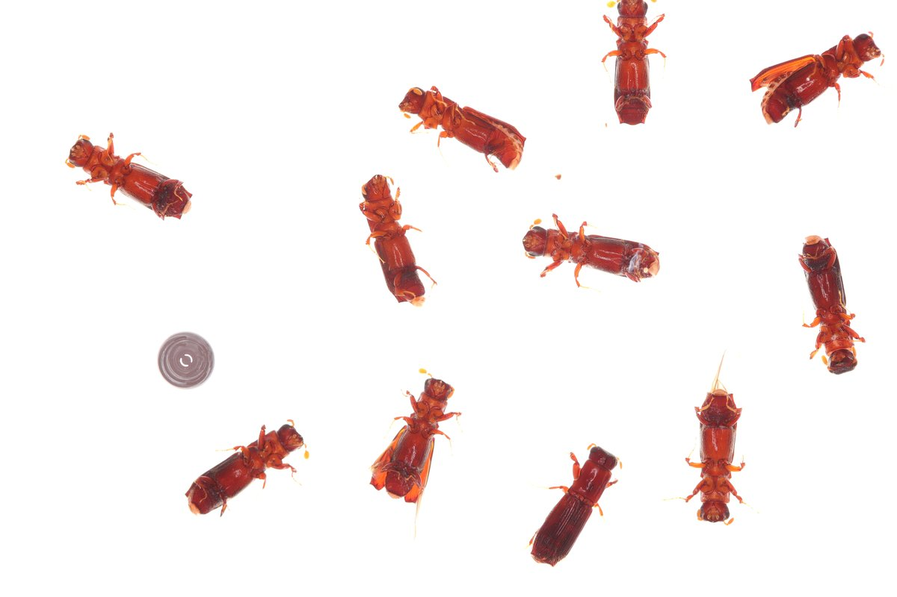
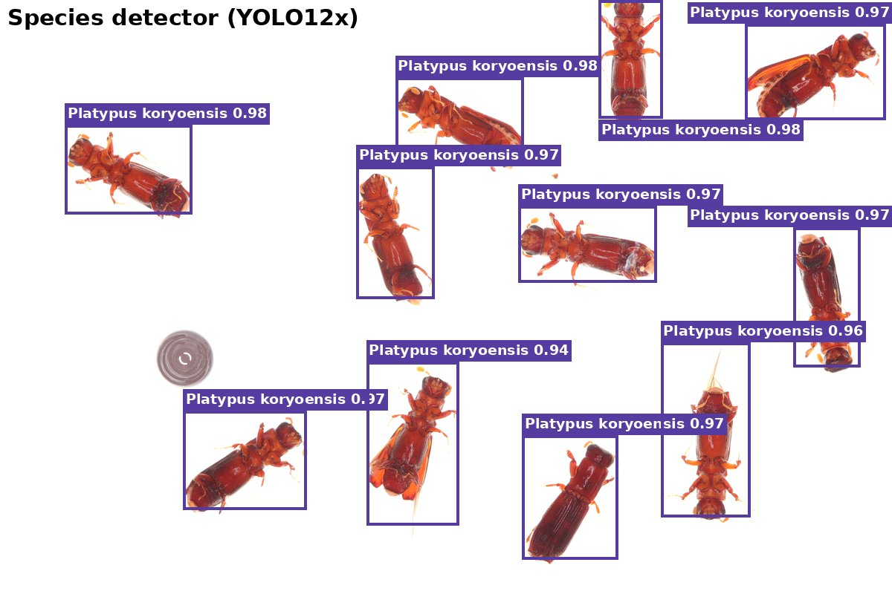
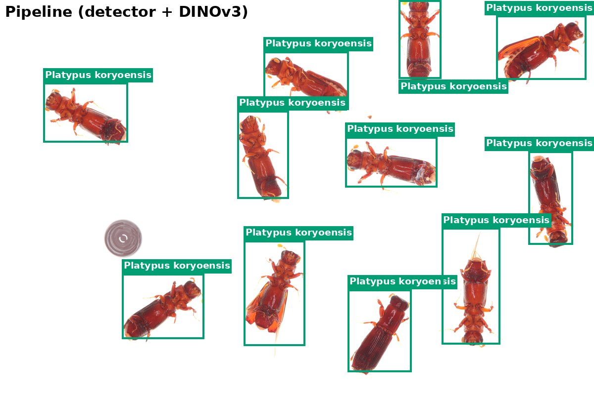
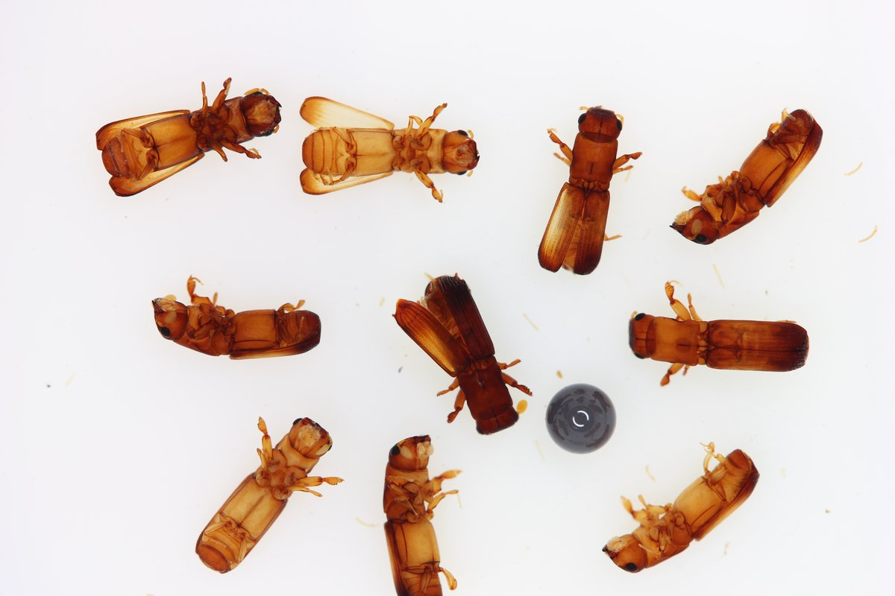
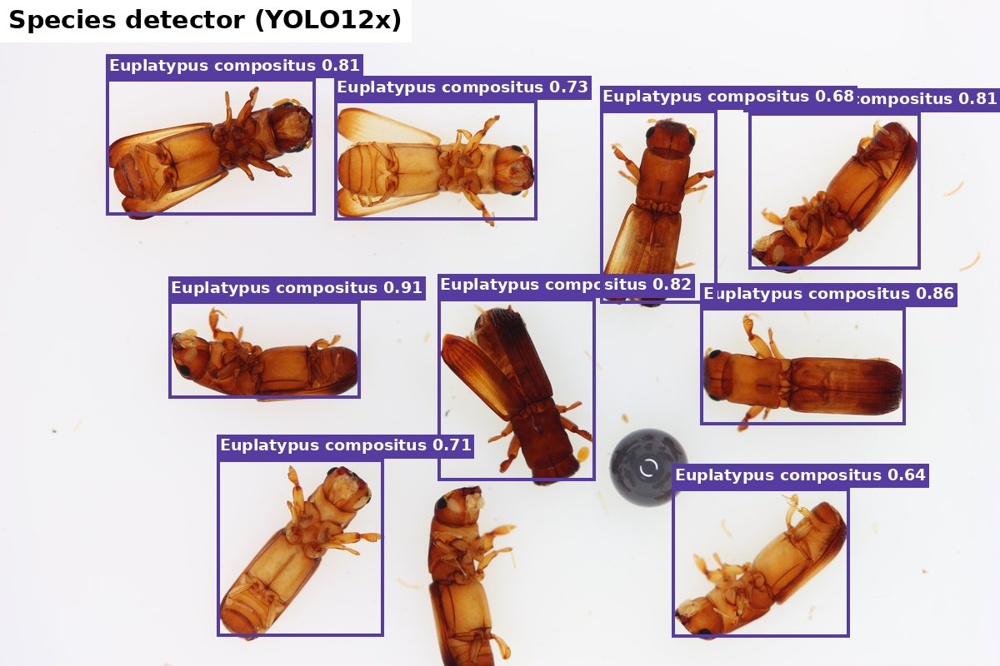
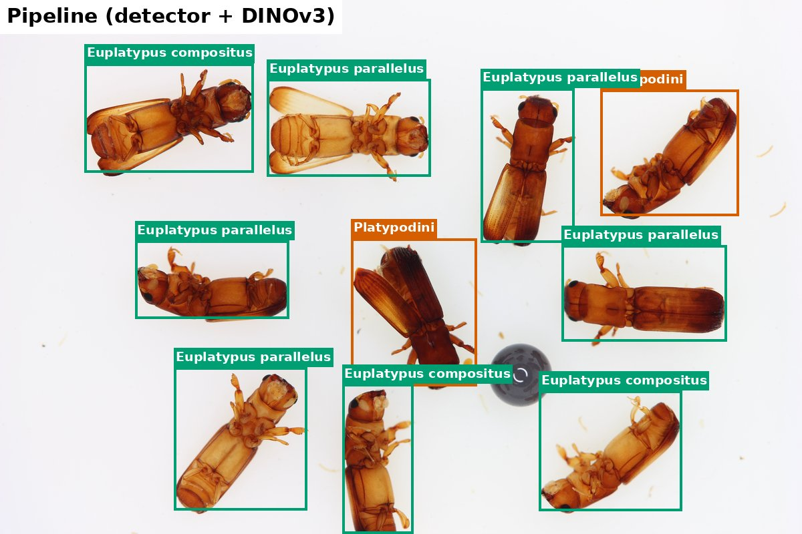
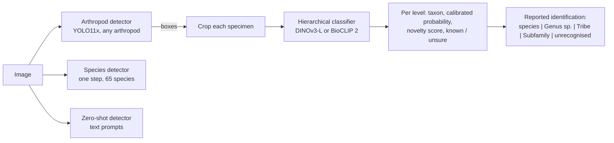

# Intelligent Bark Beetle Identifier (IBBI)

**IBBI** is a Python package that provides a simple, unified interface for detecting and identifying bark and ambrosia
beetles (Curculionidae: Scolytinae and Platypodinae) in images with trained, benchmarked computer vision models.

It finds every specimen in an image, names it at the deepest taxonomic level it can trust (species, genus, tribe or
subfamily) and says when it does not recognise a beetle, instead of forcing a species name. It also gives access to the
[Bark and Ambrosia Beetle Detection Benchmark](https://huggingface.co/datasets/IBBI-bio/bark-ambrosia-beetle-benchmark)
and scores any model on it with the benchmark's own evaluator.

```python
import ibbi

pipe = ibbi.create_pipeline()                 # arthropod detector + hierarchical classifier
result = pipe.predict("trap_sample.jpg")
for box, rec in zip(result["boxes"], result["classifications"]):
    print(box, rec["reported"])               # e.g. "Xyleborus volvulus" or "Euwallacea sp. (species undetermined)"
```

## The need for automation

Bark and ambrosia beetles are among the most damaging invasive forest insects, and quarantine, eradication and
interception decisions are made at the level of species. Identification by hand is:

* **slow:** trap samples and interception lots can contain hundreds of specimens;
* **dependent on rare expertise:** many congeners are near-identical, and few taxonomists can separate them;
* **a bottleneck:** surveillance programmes generate far more material than can be identified by hand.

Automated identification helps only if it is honest about its limits. A model that always answers with one of its
trained species will confidently misname every species it has never seen. IBBI therefore pairs detectors with a
**hierarchical classifier that abstains** ("*Euwallacea* sp.", "unrecognised"), and every model is benchmarked on
species it has never seen.

## Key features

| Feature | Entry point | Details |
|---|---|---|
| Two-stage identification (recommended) | `ibbi.create_pipeline()` | arthropod detector + hierarchical classifier, answers at the deepest trusted level |
| Arthropod detection | `ibbi.create_model("arthropod_detector")` | YOLO11x trained on 307,421 images from 14 sources; Co-DINO (EVA-02-L) for the highest accuracy |
| Hierarchical classification | `ibbi.create_model("hierarchical_classifier")` | DINOv3 or BioCLIP 2; subfamily, tribe, genus, species with calibrated probabilities and novelty scores |
| One-step species detection | `ibbi.create_model("species_detector")` | six architectures, 65 species |
| Zero-shot detection | `ibbi.create_model("zero_shot_detector")` | Grounding DINO, OWLv2, YOLO-World, SAM 3 |
| Embeddings | `model.extract_features()` | fine-tuned classifier backbones |
| Benchmark data | `ibbi.get_dataset(split)` | benchmark v2.0.1, pinned revision |
| Evaluation | `ibbi.Evaluator(model)` | reference evaluator, hierarchical metrics, embedding metrics |
| Explainability | `ibbi.Explainer(model)` | LIME and SHAP for every model |

## Examples

Two held-out benchmark trays (chosen before running the models): a trained species, *Platypus koryoensis*, and a
species the models never saw, *Platypus cylindrus*, whose correct answer is "*Platypus* sp.".

| | Input | Species detector | Pipeline (detector + DINOv3 classifier) |
|---|---|---|---|
| **Trained species** |  |  |  |
| **Unseen species** |  |  |  |

Pipeline colours: green = species, orange = genus, dark orange = tribe, pink = subfamily, red = unrecognised. More
examples, including the arthropod and zero-shot detectors, are in the [usage guide](usage.md#examples).

## How it works



## Where to go next

* **[Usage guide](usage.md):** installation, every function with examples and the format of every output.
* **[Models](models.md):** how each model was trained and selected, with licences.
* **[Benchmark results](benchmark.md):** protocol, results of every model and caveats.
* **[API reference](api.md):** generated from the docstrings.
* **[Notebooks](https://github.com/ChristopherMarais/IBBI/tree/main/notebooks):** quick start, inference, evaluation,
  explainability and scoring your own predictions
  ([open the quick start in Colab](https://colab.research.google.com/github/ChristopherMarais/IBBI/blob/main/notebooks/ibbi_quickstart.ipynb)).
* **[Changelog](changelog.md)** and **[contributing](CONTRIBUTING.md)**.
