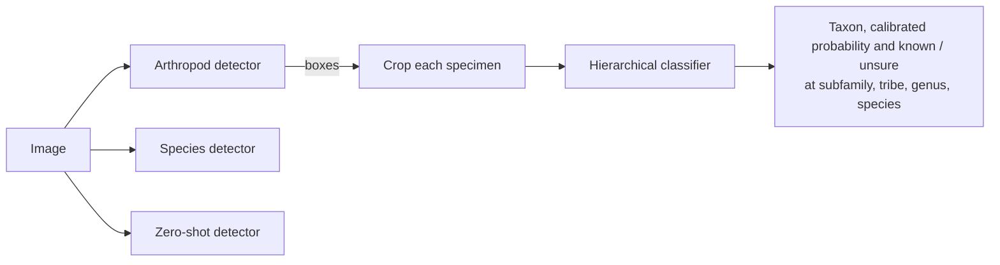

# Welcome to the Intelligent Bark Beetle Identifier (IBBI)

**IBBI** is a Python package for detecting and identifying bark and ambrosia beetles (Curculionidae: Scolytinae and
Platypodinae) in images, and for benchmarking models on the
[Bark and Ambrosia Beetle Detection Benchmark](https://huggingface.co/datasets/IBBI-bio/bark-ambrosia-beetle-benchmark).

### The need for automation

Bark and ambrosia beetles are among the most damaging invasive forest insects, and quarantine and eradication decisions
are made at the level of species. Many species are near-identical and few specialists can separate them. IBBI makes
trained and benchmarked models available with a single function call, and reports how sure they are at every
taxonomic level.

### Key features

* **Two-stage identification** (`ibbi.create_pipeline()`): a universal arthropod detector plus a hierarchical
  classifier that answers at the deepest level it trusts (species, genus, tribe, subfamily or "unrecognised").
* **One-step species detectors** for 65 species in six architectures.
* **Zero-shot detectors** with text prompts (Grounding DINO, OWLv2, YOLO-World, SAM 3).
* **Embeddings** from the fine-tuned classifier backbones.
* **Benchmark access and crowd-aware evaluation** (`ibbi.get_dataset()`, `ibbi.Evaluator`).
* **Explainability** with LIME and SHAP (`ibbi.Explainer`).

### How it works

Start with the **[usage guide](usage.md)**, see the **[models](models.md)** and the **[benchmark results](benchmark.md)**.
